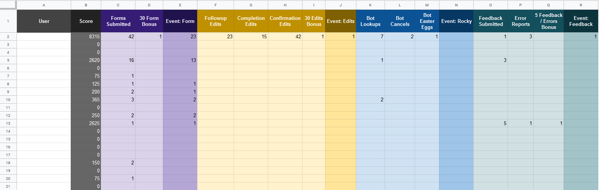

# Activity Tracking Game

Code for a game using Google Apps Script that tracks users interactions on sheets, forms, and with a Google Hangouts Chat bot. The code tallies interactions for each user in a sheet, where formulas apply points depending on the interaction.

If you want to encourage a little extra engagement to your Google Apps projects (for things like gathering feedback form submissions or testing out your chat bot's responses) though gamification, here a way to do it!

## Setup

### You'll need:

* A score sheet
* Sheet(s), form submission(s) with email requirement, chat bot interactions, etc. you want to track
* Access to the script editor for these

### Make a score sheet

You'll want to have at least 2 sheets on your score sheet: the scoreboard, and the point chart. 

The score sheet should have a list of users, a score column, and various categories of stats you want to track.

The point sheet should contain the points that the user will score for each stat, as well as any bonuses and limits.

To calculate the score, you can use a spreadsheet formula to add and multiply stats and points, like this one:
`=SUM(MULTIPLY(C2,'Point Chart'!$C$2),MULTIPLY(D2,'Point Chart'!$C$3),MULTIPLY(E2,'Point Chart'!$C$4),MULTIPLY(F2,'Point Chart'!$C$5),MULTIPLY(G2,'Point Chart'!$C$6),MULTIPLY(H2,'Point Chart'!$C$7),MULTIPLY(I2,'Point Chart'!$C$8),MULTIPLY(J2,'Point Chart'!$C$9),MULTIPLY(K2,'Point Chart'!$C$10),MULTIPLY(L2,'Point Chart'!$C$11),MULTIPLY(M2,'Point Chart'!$C$12),MULTIPLY(N2,'Point Chart'!$C$13),MULTIPLY(O2,'Point Chart'!$C$14),MULTIPLY(P2,'Point Chart'!$C$15),MULTIPLY(Q2,'Point Chart'!$C$16),0)`

Here's an example of a scoreboard that I've used for this:

 

### Place the code

For form submissions, paste in the **OnFormSubmit Tracking.js** code right at the end of your OnFormSubmit triggered function (on the Google Sheet attached to your Google Form).

For tracking sheet edits and chat bot messages, paste in the **OnEdit Tracking.js** code at the end of the execution you want to track.

### Replace the placeholders and column numbers

You'll need to replace the placeholder text with your score sheet's ID and sheet names.

You'll also need to replace the column numbers to line up with the way your score sheet is formatted.